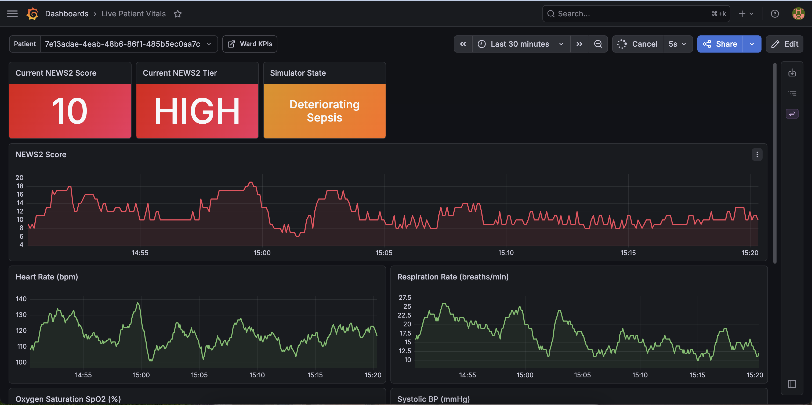
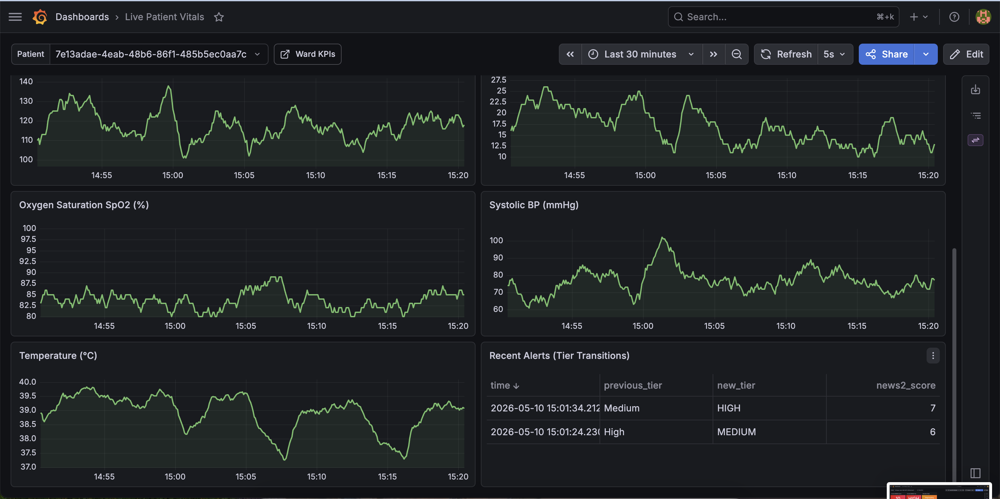
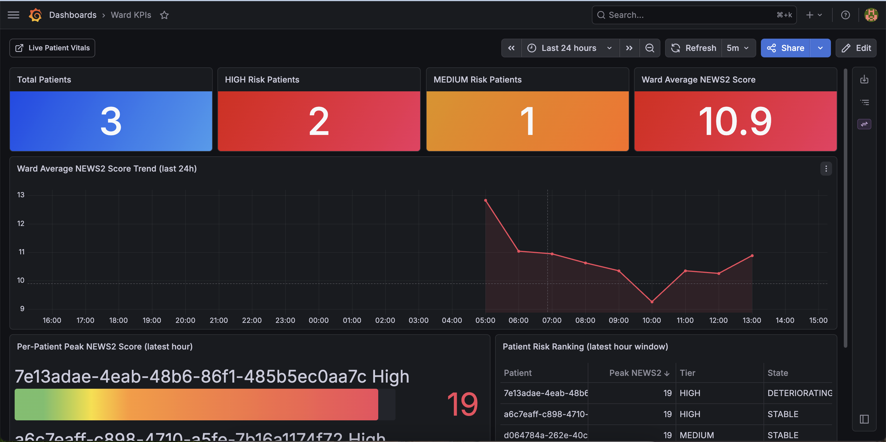
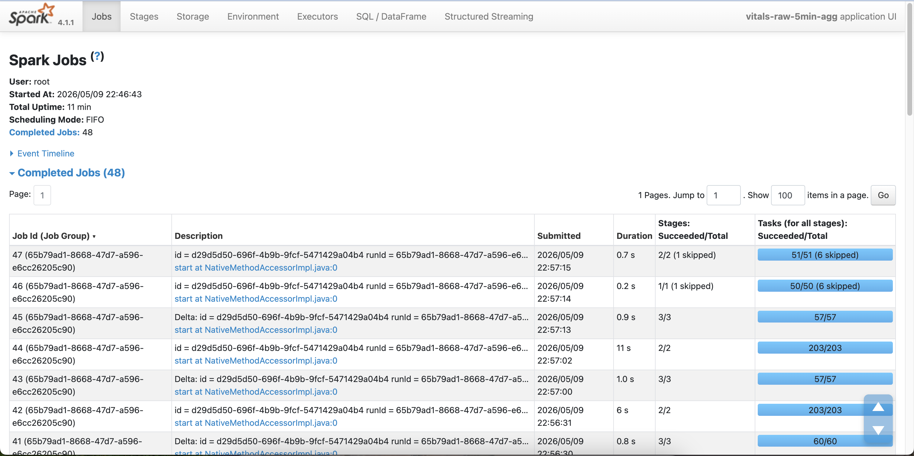
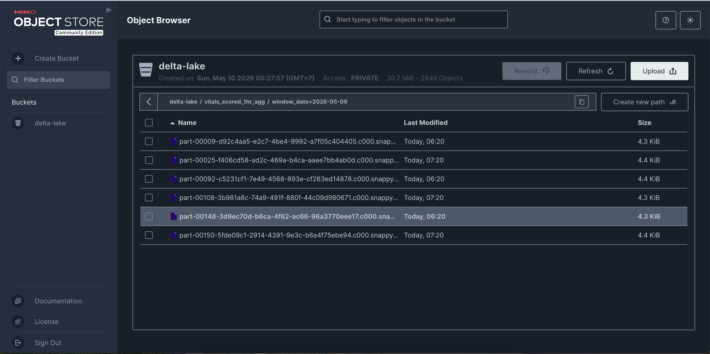
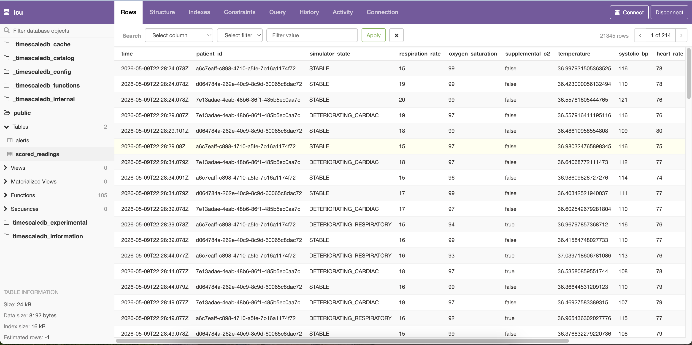

# icu-vitals-stream

> Real-time ICU vital signs pipeline: Go simulator → Kafka → Rust NEWS2 scorer → TimescaleDB → Grafana, with PySpark streaming aggregates written to Delta Lake on MinIO.

[]()
[]()

---

## Overview

`icu-vitals-stream` is an end-to-end streaming portfolio project that simulates an ICU ward of virtual patients, ingests their vital signs in real time, computes the [NEWS2 (National Early Warning Score 2)](https://www.rcp.ac.uk/improving-care/national-early-warning-score-news/) at the bedside, fires deterioration alerts, and runs longer-window analytics over the historical stream.

The goal is a realistic streaming architecture end-to-end: high-frequency producers, low-latency stateful consumers, durable event storage, and batch analytics — all grounded in a defensible clinical use case.

> **Note:** All data is synthetically generated. This project is for educational and portfolio purposes only and is **not** a medical device.

---

## Screenshots

<table>
  <tr>
    <td align="center"><b>Grafana — Live Patient Vitals (NEWS2)</b><br></td>
    <td align="center"><b>Grafana — Live Patient Vitals (charts &amp; alerts)</b><br></td>
  </tr>
  <tr>
    <td align="center"><b>Grafana — Ward KPIs</b><br></td>
    <td align="center"><b>Spark Application UI</b><br></td>
  </tr>
  <tr>
    <td align="center"><b>MinIO — Delta Lake Object Store</b><br></td>
    <td align="center"><b>TimescaleDB — pgweb</b><br></td>
  </tr>
</table>

---

## Architecture

```
Go Simulator ──▶ Kafka ──▶ Rust NEWS2 Scorer ──▶ TimescaleDB ──▶ Grafana (live vitals)
                    │                                                       ▲
                    └──▶ PySpark Structured Streaming ──▶ Delta Lake        │
                                                          (MinIO)           │
                                                              │             │
                                                         delta-reader ──────┘
                                                         (Flask API)   Grafana (ward KPIs)
```

### Data Flow

1. **Go Simulator** generates vital signs for N virtual patients, each modelled as an independent goroutine with a clinical state machine. Readings are published to `vitals.raw` using Avro serialisation via Schema Registry.
2. **Kafka** (KRaft mode, no ZooKeeper) stores topics keyed by `patient_id` to preserve per-patient ordering.
3. **Rust Scorer** consumes `vitals.raw`, maintains per-patient rolling state in memory, computes NEWS2 in real time, emits scored readings to `vitals.scored`, fires alerts on tier transitions to `vitals.alerts`, and persists everything to TimescaleDB hypertables.
4. **TimescaleDB** stores `scored_readings` and `alerts` as hypertables, indexed by `(patient_id, time DESC)`. The **Live Patient Vitals** Grafana dashboard queries this store directly.
5. **PySpark Structured Streaming** runs two jobs: a 5-minute aggregate over `vitals.raw` and a 1-hour aggregate over `vitals.scored`. Both sink to **Delta Lake on MinIO**.
6. **delta-reader** is a lightweight Flask service (backed by `delta-rs` Python bindings) that reads the Delta Lake tables and exposes them as JSON endpoints.
7. **Grafana** serves two provisioned dashboards: the live per-patient vitals view (from TimescaleDB via PostgreSQL datasource) and the ward KPIs view (from Delta Lake via the Infinity datasource → delta-reader).

### Kafka Topic Design

| Topic | Key | Partitions | Retention | Purpose |
|---|---|---|---|---|
| `vitals.raw` | `patient_id` | 6 | 1h | High-frequency raw readings from the simulator |
| `vitals.scored` | `patient_id` | 1 | 1h | Per-reading NEWS2 scores from the Rust scorer |
| `vitals.alerts` | `patient_id` | 1 | 1h | Tier-transition alerts |

Schemas are defined as Avro `.avsc` files in `infra/schemas/` and registered with Schema Registry on stack startup via `infra/scripts/register_schemas.sh`.

---

## Repository Layout

```
icu-vitals-stream/
├── simulator/                   # Go vital signs simulator
│   ├── cmd/simulator/
│   │   ├── main.go              # Entrypoint — spins up patient goroutines
│   │   └── patient.go           # Per-patient goroutine: tick loop, Kafka publish
│   ├── internal/
│   │   ├── state.go             # Clinical state machine and transition probabilities
│   │   ├── vitals.go            # InitVitals / DriftVitals — drift-based generation
│   │   └── log.go
│   ├── producer/
│   │   ├── producer.go          # Kafka producer with Avro serialisation
│   │   └── noop.go              # No-op producer for unit tests
│   ├── Dockerfile
│   └── go.mod
├── scorer/                      # Rust real-time NEWS2 scorer
│   ├── src/
│   │   ├── main.rs              # Kafka consumer loop, Tokio runtime
│   │   ├── news2.rs             # NEWS2 scoring logic (all 7 parameters)
│   │   ├── state.rs             # Per-patient rolling state (dashmap)
│   │   ├── alert.rs             # Tier-transition deduplication and alert emission
│   │   ├── scored.rs            # Publish scored readings to vitals.scored
│   │   ├── db.rs                # TimescaleDB persistence (sqlx)
│   │   ├── patient.rs           # Patient struct
│   │   ├── schema.rs            # Avro schema fetch from Schema Registry
│   │   └── vitals.rs            # Vital signs types
│   ├── Dockerfile
│   └── Cargo.toml
├── pyspark/                     # PySpark streaming jobs
│   └── jobs/
│       ├── shared.py            # SparkSession factory, Kafka/Avro helpers
│       ├── vitals_raw_5min_agg.py   # 5-min tumbling window over vitals.raw
│       └── vitals_scored_1hr_agg.py # 1-hour tumbling window over vitals.scored
├── delta-reader/                # Flask serving layer over Delta Lake
│   ├── app.py                   # /api/ward/summary, /news2-trend, /patient-ranks
│   ├── requirements.txt
│   └── Dockerfile
├── grafana/
│   └── provisioning/
│       ├── dashboards/
│       │   ├── dashboards.yaml          # Provisioning config (scans directory)
│       │   ├── patient_vitals.json      # Live per-patient vitals dashboard
│       │   └── ward_kpis.json           # Ward-level KPIs dashboard
│       └── datasources/
│           └── datasources.yaml         # TimescaleDB (postgres) + Infinity
├── infra/
│   ├── docker-compose.yml       # Full stack definition
│   ├── migrations/
│   │   └── 001_init.sql         # scored_readings and alerts hypertables
│   ├── schemas/
│   │   ├── vitals.raw.avsc
│   │   ├── vitals.scored.avsc
│   │   └── vitals.alerts.avsc
│   └── scripts/
│       └── register_schemas.sh  # Registers Avro schemas on startup
├── Makefile
└── README.md
```

---

## Getting Started

### Prerequisites

- [Docker Desktop](https://www.docker.com/products/docker-desktop/) (includes Docker Compose)
- `make`

No local Go, Rust, or Python installation is required — everything runs inside Docker.

### Bring Up the Full Stack

```bash
# Clone the repo
git clone https://github.com/agusrichard/icu-vitals-stream.git
cd icu-vitals-stream

# Start all services
make all
# equivalent: docker compose -f infra/docker-compose.yml up --build
```

This starts the following services in dependency order:

| Service | URL | Credentials |
|---|---|---|
| Grafana | http://localhost:3000 | admin / admin |
| MinIO console | http://localhost:9001 | minioadmin / minioadmin |
| TimescaleDB (pgweb) | http://localhost:8082 | — |
| Spark master UI | http://localhost:8080 | — |
| Schema Registry | http://localhost:8081 | — |
| Kafka | localhost:9094 | — |

After ~30 seconds, vital signs will be flowing through the pipeline. Open Grafana and navigate to **Dashboards → Live Patient Vitals** to see live readings.

### Submit the PySpark Streaming Jobs

The PySpark container starts as a Spark master but does not auto-submit jobs. Submit them manually:

```bash
# 5-minute aggregates from vitals.raw → Delta Lake
make pyspark-submit-raw

# 1-hour aggregates from vitals.scored → Delta Lake
make pyspark-submit-scored
```

Both jobs run continuously (Structured Streaming). Once at least one 1-hour window has closed, the **Ward KPIs** dashboard in Grafana will populate.

### Useful Commands

```bash
# Tear down all containers and volumes
make down

# Bring up only the core pipeline (Kafka, Schema Registry, TimescaleDB, simulator, scorer)
make infra
make simulator

# Open an interactive PySpark shell with Delta Lake and MinIO configured
make pyspark-shell

# Query TimescaleDB directly
docker exec -it timescaledb psql -U icu -d icu -c "SELECT patient_id, count(*) FROM scored_readings GROUP BY 1 ORDER BY 1;"

# Check a Delta Lake table
curl http://localhost:5001/api/ward/patient-ranks
```

---

## Services

### Go Simulator

**Image:** built from `simulator/Dockerfile`  
**Config:** `PATIENTS` env var (default 3), `BROKERS`, `SCHEMA_REGISTRY_URL`

Spawns one goroutine per patient. Each goroutine runs a tick loop (every ~2 seconds) that:

1. Probabilistically transitions the patient's clinical state.
2. Generates the next vital sign reading using `DriftVitals` — a drift formula that moves each parameter gradually toward the new state's target centre, producing smooth trajectories rather than instant jumps.
3. Publishes the reading as an Avro message to `vitals.raw`, keyed by `patient_id`.

### Rust Scorer

**Image:** built from `scorer/Dockerfile`  
**Config:** `BROKERS`, `GROUP_ID`, `SCHEMA_REGISTRY_URL`, `DATABASE_URL`

Consumes `vitals.raw` with one consumer per Tokio task. For each message:

1. Deserialises the Avro payload.
2. Computes NEWS2 score and tier (see [NEWS2 Algorithm](#the-news2-scoring-algorithm)).
3. Checks the per-patient state in a `dashmap` for tier transitions; emits an alert to `vitals.alerts` if the tier changed.
4. Publishes the scored reading to `vitals.scored`.
5. Persists the scored reading and any alert to TimescaleDB via `sqlx`.

### PySpark Jobs

**Image:** `apache/spark:4.1.1-python3`  
**Packages:** `spark-sql-kafka`, `spark-avro`, `delta-spark`, `hadoop-aws`

Both jobs use Avro deserialization through Schema Registry, a 10-minute watermark for late data, and write to Delta Lake on MinIO using `outputMode("append")`.

| Job | Source | Window | Sink |
|---|---|---|---|
| `vitals_raw_5min_agg.py` | `vitals.raw` | 5 minutes | `s3a://delta-lake/vitals_raw_5min_agg` |
| `vitals_scored_1hr_agg.py` | `vitals.scored` | 1 hour | `s3a://delta-lake/vitals_scored_1hr_agg` |

### delta-reader

**Image:** built from `delta-reader/Dockerfile`  
**Port:** 5001 (host) → 5000 (container)

A Flask service that reads `vitals_scored_1hr_agg` from Delta Lake using the `deltalake` Python package (delta-rs bindings) and serves three JSON endpoints consumed by the Grafana Infinity datasource:

| Endpoint | Returns |
|---|---|
| `GET /api/ward/summary` | Single-object array: total patients, HIGH/MEDIUM/LOW counts, ward avg NEWS2 |
| `GET /api/ward/news2-trend` | Array of `{window_start, avg_news2_score}` for the last 24 hours |
| `GET /api/ward/patient-ranks` | Per-patient `{patient_id, max_news2_score, news2_tier, simulator_state}`, sorted by peak NEWS2 descending |

### Grafana Dashboards

Both dashboards are fully provisioned from JSON files in `grafana/provisioning/dashboards/` — no manual UI configuration required.

**Live Patient Vitals** (`/d/patient-vitals`)  
Source: TimescaleDB `scored_readings` hypertable  
Panels: current NEWS2 score (stat), current tier (stat), simulator state (stat), NEWS2 trend (time-series), heart rate, respiration rate, SpO₂, systolic BP, temperature (all time-series), recent tier-transition alerts (table)  
Refresh: 5 seconds

**Ward KPIs** (`/d/ward-kpis`)  
Source: Delta Lake `vitals_scored_1hr_agg` via delta-reader (Infinity datasource)  
Panels: total patients (stat), HIGH risk count (stat), MEDIUM risk count (stat), ward avg NEWS2 (stat), 24h NEWS2 trend (time-series), per-patient peak NEWS2 (bar gauge), patient risk ranking (table)  
Refresh: 5 minutes

---

## The NEWS2 Scoring Algorithm

NEWS2 (National Early Warning Score 2) was published by the Royal College of Physicians in 2017 and is the standard early warning system for identifying acutely ill patients in NHS England. The Rust scorer implements it by scoring seven physiological parameters 0–3 based on deviation from normal, then summing them (maximum 20).

### Respiratory Rate (breaths/min)

| Range | Score |
|---|---|
| ≤ 8 | 3 |
| 9–11 | 1 |
| 12–20 | 0 |
| 21–24 | 2 |
| ≥ 25 | 3 |

### SpO₂

Scale 1 applies to all patients. Scale 2 (for COPD patients targeting SpO₂ 88–92%) is out of scope — none of the clinical states model chronic CO₂ retention.

| Range | Score |
|---|---|
| ≤ 91% | 3 |
| 92–93% | 2 |
| 94–95% | 1 |
| ≥ 96% | 0 |

### Supplemental Oxygen

| | Score |
|---|---|
| Room air | 0 |
| Any supplemental O₂ | 2 |

### Systolic Blood Pressure (mmHg)

| Range | Score |
|---|---|
| ≤ 90 | 3 |
| 91–100 | 2 |
| 101–110 | 1 |
| 111–219 | 0 |
| ≥ 220 | 3 |

### Heart Rate (bpm)

| Range | Score |
|---|---|
| ≤ 40 | 3 |
| 41–50 | 1 |
| 51–90 | 0 |
| 91–110 | 1 |
| 111–130 | 2 |
| ≥ 131 | 3 |

### Temperature (°C)

| Range | Score |
|---|---|
| ≤ 35.0 | 3 |
| 35.1–36.0 | 1 |
| 36.1–38.0 | 0 |
| 38.1–39.0 | 1 |
| ≥ 39.1 | 2 |

### Consciousness (ACVPU)

New Confusion (C) was added in NEWS2 because it is often the earliest sign of sepsis or hypoxia — a patient can be confused while appearing physically well, and that single finding scores 3.

| Level | Meaning | Score |
|---|---|---|
| **A** — Alert | Fully awake and oriented | 0 |
| **C** — New Confusion | Awake but disoriented or rambling | 3 |
| **V** — Voice | Responds only to voice | 3 |
| **P** — Pain | Responds only to pain | 3 |
| **U** — Unresponsive | No reaction | 3 |

### Escalation Thresholds

| Score | Risk | Required Response |
|---|---|---|
| 0 | Low | Routine monitoring, minimum 12-hourly obs |
| 1–4 | Low | Minimum 12-hourly; nurse decides whether to escalate |
| Any single parameter = 3 | Low–Medium | Urgent assessment by registered nurse |
| 5–6 | Medium | Urgent clinician review; minimum hourly obs |
| ≥ 7 | **High** | Emergency response team; consider HDU/ICU transfer |

---

## Clinical States

Each simulated patient holds one of six states and transitions probabilistically on every tick. The `simulator_state` field is attached to every emitted message as ground truth — it is never read by the Rust scorer.

### Stable

Normal physiology. NEWS2 score typically 0–2.

| Parameter | Range |
|---|---|
| Respiratory rate | 12–20 breaths/min |
| SpO₂ | 95–99% |
| Supplemental O₂ | No |
| Temperature | 36.1–37.2 °C |
| Systolic BP | 110–130 mmHg |
| Heart rate | 60–80 bpm |
| Consciousness | Alert |

### Deteriorating — Sepsis

Infection-driven organ dysfunction. High fever, elevated heart rate, low blood pressure, elevated respiratory rate. NEWS2 score typically 4–7.

| Parameter | Range |
|---|---|
| Respiratory rate | 20–30 breaths/min |
| SpO₂ | 93–97% |
| Supplemental O₂ | ~20% chance |
| Temperature | 38.5–40.0 °C |
| Systolic BP | 85–105 mmHg |
| Heart rate | 100–140 bpm |
| Consciousness | Alert or Voice |

### Deteriorating — Respiratory

Acute respiratory failure. Very high breathing effort, low SpO₂, mandatory supplemental oxygen. NEWS2 score typically 5–8.

| Parameter | Range |
|---|---|
| Respiratory rate | 25–35 breaths/min |
| SpO₂ | 88–93% |
| Supplemental O₂ | Always |
| Temperature | 36.5–37.5 °C |
| Systolic BP | 105–125 mmHg |
| Heart rate | 90–120 bpm |
| Consciousness | Alert or Voice |

### Deteriorating — Cardiac

Cardiovascular instability. Distinguished from sepsis by absence of fever. NEWS2 score typically 4–7.

| Parameter | Range |
|---|---|
| Respiratory rate | 18–26 breaths/min |
| SpO₂ | 92–96% |
| Supplemental O₂ | ~40% chance |
| Temperature | 36.0–37.0 °C |
| Systolic BP | 80–100 mmHg |
| Heart rate | 100–150 bpm |
| Consciousness | Alert or Voice |

### Post-Op Recovering

Post-surgical stress, trending toward stable. NEWS2 score typically 1–4.

| Parameter | Range |
|---|---|
| Respiratory rate | 14–22 breaths/min |
| SpO₂ | 93–97% |
| Supplemental O₂ | ~30% chance |
| Temperature | 36.8–37.8 °C |
| Systolic BP | 100–120 mmHg |
| Heart rate | 75–95 bpm |
| Consciousness | Alert |

### Septic Shock

Cardiovascular collapse. Critically low blood pressure, very high heart rate, altered consciousness. NEWS2 score typically ≥ 7.

| Parameter | Range |
|---|---|
| Respiratory rate | 25–38 breaths/min |
| SpO₂ | 85–91% |
| Supplemental O₂ | Always |
| Temperature | 38.5–41.0 °C |
| Systolic BP | 60–85 mmHg |
| Heart rate | 120–160 bpm |
| Consciousness | Voice, Pain, or Unresponsive |

---

## Simulator State Transitions

The state machine transitions states probabilistically each tick. Without additional handling, each transition would be an abrupt jump — one tick stable, the next fully septic.

### Drift-Based Vital Sign Generation

When a state transition occurs, vital sign parameters drift gradually toward the new state's target rather than jumping instantly:

```
new_value = prev_value + rate × (target_centre − prev_value) + noise
```

The drift rate is determined by the destination state:

| Destination | Rate | Rationale |
|---|---|---|
| Stable | 0.05 | Recovery is gradual |
| Deteriorating Sepsis / Respiratory / Cardiac | 0.05 | Slow enough to produce a pre-deterioration ramp |
| Post-Op Recovering | 0.07 | Bounded post-op stress, slightly faster |
| Septic Shock | 0.10 | Cardiovascular collapse accelerates faster |

With a 5-second tick and rate 0.05, a patient reaches ~23% of the target state after 25 seconds and ~64% after 100 seconds. A 5-minute window therefore captures most of the drift trajectory — giving the analytics layer a genuine pre-deterioration signal before any NEWS2 threshold is crossed.

### Transition Constraints

`PostOpRecovering` represents a post-surgical patient — a state entered from the operating room, not from deterioration. As a result:

- **Stable** can transition to any deteriorating state, but not to `PostOpRecovering`.
- **Deteriorating and SepticShock states** can recover to Stable or escalate, but not to `PostOpRecovering`.
- **PostOpRecovering** transitions only to Stable (recovery) or any deteriorating state (post-op complication).

---

## Analytics Pipeline

### 5-Minute Streaming Aggregates

**Source:** `vitals.raw` | **Sink:** `s3a://delta-lake/vitals_raw_5min_agg`

One row per `(patient_id, 5-minute window)`. Written with `trigger(processingTime="30 seconds")`.

| Field | Description |
|---|---|
| `patient_id` | Patient identifier |
| `window_start`, `window_end` | Window boundaries |
| `avg_heart_rate` | Mean heart rate over the window |
| `avg_respiration_rate` | Mean respiration rate |
| `avg_oxygen_saturation` | Mean SpO₂ |
| `min_oxygen_saturation` | Minimum SpO₂ (clinically significant extreme) |
| `avg_systolic_bp` | Mean systolic blood pressure |
| `avg_temperature` | Mean temperature |
| `reading_count` | Number of raw readings aggregated |
| `simulator_state` | Patient's clinical state at window start (ML ground truth) |
| `window_date` | Partition column derived from `window_start` |

### 1-Hour Streaming Aggregates

**Source:** `vitals.scored` | **Sink:** `s3a://delta-lake/vitals_scored_1hr_agg`

One row per `(patient_id, 1-hour window)`. Written with `trigger(processingTime="5 minutes")`. This table is the primary source for the Ward KPIs dashboard.

| Field | Description |
|---|---|
| `patient_id` | Patient identifier |
| `window_start`, `window_end` | Window boundaries |
| `avg_heart_rate` … `avg_temperature` | Per-vital averages over the window |
| `min_oxygen_saturation` | Minimum SpO₂ in the window |
| `avg_news2_score` | Mean NEWS2 score over the window |
| `max_news2_score` | Peak NEWS2 score in the window |
| `news2_tier` | NEWS2 tier at window start (`Low`, `Medium`, `High`) |
| `reading_count` | Number of scored readings aggregated |
| `simulator_state` | Patient's clinical state at window start |
| `window_date` | Partition column |

---

## Tech Stack

| Component | Technology | Version |
|---|---|---|
| Simulator | Go | 1.26 |
| Kafka client (Go) | `IBM/sarama` | 1.48.0 |
| Avro (Go) | `linkedin/goavro` | 2.14.1 |
| Scorer | Rust (stable) | edition 2024 |
| Async runtime | Tokio | 1 |
| Kafka client (Rust) | `rdkafka` (librdkafka) | 0.39 |
| Avro (Rust) | `apache-avro` | 0.17 |
| In-memory state | `dashmap` | 6 |
| DB client (Rust) | `sqlx` | 0.8 |
| Message broker | Apache Kafka (KRaft) | 8.2.0 (Confluent) |
| Schema registry | Confluent Schema Registry | 8.2.0 |
| Time-series DB | TimescaleDB | 2.26.3-pg16 |
| Streaming analytics | Apache Spark / PySpark | 4.1.1 |
| Delta Lake connector | `delta-spark` | 4.1.0 |
| Object storage | MinIO | latest |
| Delta Lake reader | `deltalake` (delta-rs) | 1.5.1 |
| Serving layer | Flask | 3.1.1 |
| Dashboards | Grafana | 13.0.1 |

---

## Design Decisions

- **Per-patient Kafka keying.** All topics are keyed by `patient_id` to preserve ordering within a patient's stream. Cross-patient ordering is irrelevant clinically.
- **Rust over Go for the scorer.** Both could handle this. Rust earns its complexity here: predictable latency and zero GC pauses on the scoring hot path are concrete requirements for a real-time clinical alerter.
- **Drift-based simulation.** Without drift, every state transition is an abrupt jump — no pre-deterioration signal for the analytics layer to detect. The drift formula produces a gradual slope that appears in the 5-minute aggregate windows before any NEWS2 threshold is crossed.
- **delta-rs serving layer.** Delta Lake files are Parquet — Grafana cannot read them directly. Rather than running a second PySpark session for reads (slow startup, high RAM), a `delta-rs`-backed Flask service reads the tables in milliseconds and serves the data as JSON for the Infinity datasource.
- **Two Grafana dashboards.** The per-patient view (from TimescaleDB, 5-second refresh) is the bedside view — a nurse watches one patient in real time. The ward KPIs view (from Delta Lake, 5-minute refresh) is the charge nurse view — sustained trends across the whole ward.

---

## Disclaimer

This project uses entirely synthetic data and is intended for educational and portfolio purposes only. It is **not** a medical device, has not been clinically validated, and must not be used for any real patient care decisions. The NEWS2 algorithm is implemented as described in published clinical literature, but its application here is purely illustrative.

---

## License

Apache License 2.0 — see [LICENSE](LICENSE) for details.
